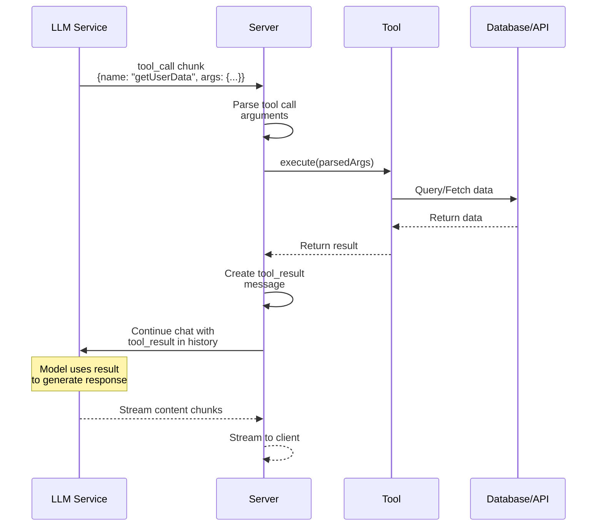
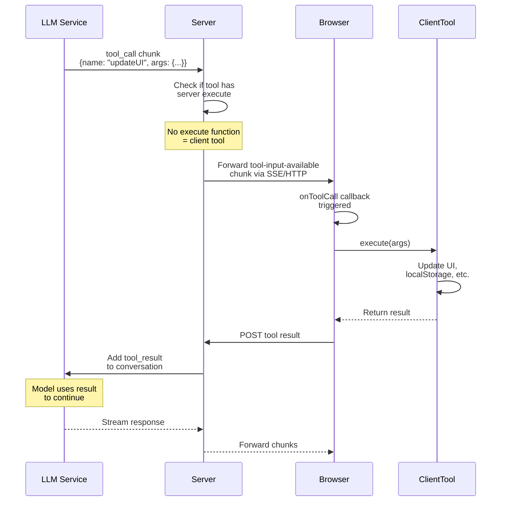

# Liva Chat Multimodal Chat with Board

Version: v1 (MVP)
Audience: Tech Developers

---

## 1. Product Overview

Liva Chat is a turn based, developer focused, multimodal chat system with an Excalidraw backed board. The system supports text and audio input, text and audio output, and optional visualizations generated inside the chat with the ability to promote them to the board.

Core principle: the LLM is stateless and blind by default. All state, orchestration, and guardrails live inside a Conversation Durable Object backed by SQL storage.

---

## 2. UX Design

### 2.1 Primary User Journey

1. User opens Liva Chat and starts a new conversation

2. User interacts via text or push to talk

3. Assistant responds with streamed text and optional audio

4. When a visualization is useful, assistant generates an inline diagram in chat

5. User may copy the visualization to the board

6. Conversation can be archived and a new one started

---

### 2.2 Interaction Modes

#### Input Modes

* Text mode (default)
* Push to talk (turn based, no VAD)

#### Output Modes

* Text only
* Audio with hidden text (text stored internally)

User can toggle modes at any time. Mode changes apply to subsequent turns only.

---

### 2.3 Chat UX

* Left aligned user bubbles
* Right aligned assistant bubbles
* Assistant bubble may contain:

  * Streamed text
  * Audio playback control
  * Inline visualization card

#### Inline Visualization Card

* Rendered Mermaid or SVG preview
* Title
* Actions:

  * Copy to board
  * Expand

This keeps the board clean and avoids premature pollution.

---

### 2.4 Board UX

* Board updates animate when new elements are added

---

## 3. UI Structure

###

---

### 3.2 Core Components

* ConversationShell
* ChatTimeline
* ChatBubble
* AudioBubble
* VisualizationCard
* InputBar
* ModeToggle

---

## 4. High Level Design (HLD)

### 4.1 System Architecture

```
Client (Web)
  |
  | Streaming fetch / WebSocket
  v
Conversation Durable Object
  |
  |-- SQL Storage (Messages, Board)
  |-- Workers AI (STT)
  |-- Primary LLM via TanStack AI
  |-- Workers AI (TTS)
  |-- Excalidraw Renderer
```

---

### 4.2 Responsibility Split

#### Client

* UI rendering
* Audio capture and playback
* Streaming consumption

#### Durable Object

* Conversation state machine
* SQL persistence
* Tool execution
* Cost guardrails
* Streaming orchestration

#### LLM

* Reasoning
* Tool invocation
* Teaching and explanation

---

## 5. Low Level Design (LLD)

### 5.1 SQL Schema

#### conversations

| column      | type      |
| ----------- | --------- |
| id          | text (pk) |
| created_at  | integer   |
| archived_at | integer   |
| title       | text      |

#### messages

| column          | type      |
| --------------- | --------- |
| id              | text (pk) |
| conversation_id | text      |
| role            | text      |
| content         | json      |
| created_at      | integer   |

#### board_state

| column          | type      |
| --------------- | --------- |
| conversation_id | text (pk) |
| version         | integer   |
| image_url       | text      |
| last_mermaid    | text      |

#### visualizations

| column          | type      |
| --------------- | --------- |
| id              | text (pk) |
| conversation_id | text      |
| mermaid         | text      |
| image_url       | text      |
| created_at      | integer   |

---

### 5.2 Tool Definitions

#### Tool: read_board

Input:

```
{}
```

Output:

```
{ boardImageUrl, version, title }
```

---

#### Tool: generateVisualization

Purpose: generate a lightweight diagram for inline chat use.

Input:

```
{ mermaid: string, title?: string }
```

Execution:

* Validate mermaid
* Render preview image
* Persist visualization row

Output:

```
{ visualizationId, imageUrl }
```

---

#### Tool: append_board

Input:

```
{ visualizationId }
```

Execution:

* Load visualization
* Convert mermaid to Excalidraw elements
* Append to board
* Re render board image
* Increment version

Output:

```
{ success, boardImageUrl }
```

---

### 5.3 Conversation Flow

1. User input arrives
2. DO persists user message
3. DO invokes LLM with streaming
4. LLM may call tools
5. Tools execute synchronously inside DO
6. Results appended as tool messages
7. Assistant response streamed to client
8. Optional audio generated per chunk

---

### 5.4 Streaming Implementation

* TanStack AI chat with stream: true
* Each token chunk triggers:

  * client text update
  * optional TTS call

Audio chunks are buffered and streamed back incrementally.

---

### 5.5 Error Handling

* Mermaid parse errors surface as assistant messages
* Tool failures do not crash conversation
* Board append is atomic per version

---

## 6. Non Goals (Explicit)

* Live collaboration
* Real time speech interruption
* Board as structured source of truth
* VAD
* Concurrent tool execution

---

## 7. V1 Success Criteria

* Stable 1 hour sessions
* Predictable costs
* Clear teaching flow
* Minimal board clutter
* Deterministic board evolution

---

## 8. Future Extensions

* VAD and real time speech
* Multi user boards
* Vector board source of truth
* Model driven board summarization
* Tool confidence scoring


--- 
title: "Community Adapters Guide"
slug: /community-adapters/guide
order: 1
---

# Community Adapters Guide

This guide explains how to create and contribute community adapters for the TanStack AI ecosystem.

Community adapters extend TanStack AI by integrating external services, APIs, or custom model logic. They are authored and maintained by the community and can be reused across projects.

## What is a Community Adapter?

A community adapter is a reusable module that connects TanStack AI to an external provider or system.

Common use cases include:
- Integrating third-party AI model providers
- Implementing custom inference or routing logic
- Exposing provider-specific tools or capabilities
- Connecting to non-LLM AI services (e.g. images, embeddings, video)

Community adapters are **not maintained by the core TanStack AI team**, and can be reused across different projects.

## Creating a Community Adapter

Follow the steps below to build a well-structured, type-safe adapter.

### 1. Set up your project

Start by reviewing the [existing internal adapter implementations in the TanStack AI GitHub repository](https://github.com/tanstack/ai/tree/main/packages/typescript). These define the expected structure, conventions, and integration patterns.

For a complete, detailed reference, use the [OpenAI adapter](https://github.com/tanstack/ai/tree/main/packages/typescript/ai-openai), which is the most fully featured implementation.

### 2. Define model metadata

Model metadata describes each model’s capabilities and constraints and is used by TanStack AI for compatibility checks and feature selection.

Your metadata should define, at a minimum:

- Model name and identifier
- Supported input and output modalities
- Supported features (e.g. streaming, tools, structured output)
- Pricing or cost information (if available)
- Any provider-specific notes or limitations

Refer to the [OpenAI adapter’s model metadata](https://github.com/TanStack/ai/blob/main/packages/typescript/ai-openai/src/model-meta.ts) for a concrete example.

### 3. Define model capability arrays 

After defining metadata, group models by supported functionality using exported arrays. These arrays allow TanStack AI to automatically select compatible models for a given task.

Example:
```typescript
export const OPENAI_CHAT_MODELS = [
  // Frontier models
  GPT5_2.name,
  GPT5_2_PRO.name,
  GPT5_2_CHAT.name,
  GPT5_1.name,
  GPT5_1_CODEX.name,
  GPT5.name,
  GPT5_MINI.name,
  GPT5_NANO.name,
  GPT5_PRO.name,
  GPT5_CODEX.name,
  // ...other models
] as const
export const OPENAI_IMAGE_MODELS = [
  GPT_IMAGE_1.name,
  GPT_IMAGE_1_MINI.name,
  DALL_E_3.name,
  DALL_E_2.name,
] as const

export const OPENAI_VIDEO_MODELS = [SORA2.name, SORA2_PRO.name] as const
```
Each array should only include models that fully support the associated functionality.

### 4. Define model provider options

Each model exposes a different set of configurable options. These options must be typed per model name so that users only see valid configuration options.

Example:
```typescript
export type OpenAIChatModelProviderOptionsByName = {
  [GPT5_2.name]: OpenAIBaseOptions &
    OpenAIReasoningOptions &
    OpenAIStructuredOutputOptions &
    OpenAIToolsOptions &
    OpenAIStreamingOptions &
    OpenAIMetadataOptions
  [GPT5_2_CHAT.name]: OpenAIBaseOptions &
    OpenAIReasoningOptions &
    OpenAIStructuredOutputOptions &
    OpenAIToolsOptions &
    OpenAIStreamingOptions &
    OpenAIMetadataOptions
  // ... repeat for each model
}

```
This ensures strict type safety and feature correctness at compile time.

### 5. Define supported input modalities

Models typically support different input modalities (e.g. text, images, audio). These must be defined per model to prevent invalid usage.

Example:
```typescript
export type OpenAIModelInputModalitiesByName = {
  [GPT5_2.name]: typeof GPT5_2.supports.input
  [GPT5_2_PRO.name]: typeof GPT5_2_PRO.supports.input
  [GPT5_2_CHAT.name]: typeof GPT5_2_CHAT.supports.input
  //  ... repeat for each model
}
```

### 6. Define model option fragments

Model options should be composed from reusable fragments rather than duplicated per model.

A common pattern is:
- Base options shared by all models
- Feature fragments that are stitched together per model

Example (based on [OpenAI models](https://github.com/TanStack/ai/blob/main/packages/typescript/ai-openai/src/text/text-provider-options.ts)):
```typescript
export interface OpenAIBaseOptions {
  // base options that every chat model supports
}

// Feature fragments that can be stitched per-model 

/**
 * Reasoning options for models  
 */
export interface OpenAIReasoningOptions {
   //...
}
 
/**
 * Structured output options for models.
 */
export interface OpenAIStructuredOutputOptions {
  //...
}
```


Models can then opt into only the features they support:

```typescript
export type OpenAIChatModelProviderOptionsByName = {
  [GPT5_2.name]: OpenAIBaseOptions &
    OpenAIReasoningOptions &
    OpenAIStructuredOutputOptions &
    OpenAIToolsOptions &
    OpenAIStreamingOptions &
    OpenAIMetadataOptions
}
```

There is no single correct composition; this structure should reflect the capabilities of the provider you are integrating.

### 7. Implement adapter logic

Finally, implement the adapter’s runtime logic.

This includes:
- Sending requests to the external service
- Handling streaming and non-streaming responses
- Mapping provider responses to TanStack AI types
- Enforcing model-specific options and constraints

Adapters are implemented per capability, so only implement what your provider supports:

- Text adapter
- Chat adapter
- Image adapter
- Embeddings adapter
- Video adapter

Refer to the [OpenAI adapter](https://github.com/TanStack/ai/blob/main/packages/typescript/ai-openai/src/adapters/text.ts) for a complete, end-to-end implementation example.

### 8. Publish and submit a PR

Once your adapter is complete:
1. Publish it as an npm package
2. Open a PR to the [TanStack AI repository](https://github.com/TanStack/ai/pulls)
3. Add your adapter to the [Community Adapters list in the documentation](https://github.com/TanStack/ai/tree/main/docs/community-adapters)

### 9. Sync documentation configuration

After adding your adapter, run the  `pnpm run sync-docs-config` in the root of the TanStack AI monorepo. This ensures your adapter appears correctly in the documentation navigation. Open a PR with the generated changes.

### 10. Maintain your adapter

As a community adapter author, you are responsible for ongoing maintenance.

This includes:

- Tracking upstream provider API changes
- Keeping compatibility with TanStack AI releases
- Addressing issues and feedback from users
- Updating documentation when features change

If you add new features or breaking changes, open a follow-up PR to keep the docs in sync.

---
title: Tools
id: tools
order: 1
---

Tools (also called "function calling") allow AI models to interact with external systems, APIs, or perform computations. TanStack AI provides an isomorphic tool system that enables type-safe, framework-agnostic tool definitions that work on both server and client.

Tools enable your AI application to:

- **Fetch data** from APIs or databases
- **Perform calculations** or data transformations
- **Interact with services** like email, calendars, or payment systems
- **Execute client-side operations** like updating UI or local storage
- **Create hybrid tools** that execute in both server and client contexts

## Framework Support

TanStack AI works with **any** JavaScript framework:
- Next.js, Express, Remix, Fastify, etc.
- React, Vue, Solid, Svelte, vanilla JS, etc.

TanStack AI works with any JavaScript framework.

## Isomorphic Tool Architecture

TanStack AI uses a two-step tool definition process:

1. **Define once** with `toolDefinition()` - Creates a shared tool schema
2. **Implement** with `.server()` or `.client()` - Add execution logic for each environment

This approach provides:

- **Type Safety**: Full TypeScript inference from Zod schemas
- **Code Reuse**: Define schemas once, use everywhere
- **Flexibility**: Tools can execute on server, client, or both
- **Schema Options**: Use Zod schemas or raw JSON Schema objects

## Schema Options

TanStack AI supports two ways to define tool schemas:

### Option 1: Zod Schemas (Recommended)

Zod schemas provide full TypeScript type inference and runtime validation:

```typescript
import { z } from "zod";

const inputSchema = z.object({
  location: z.string().describe("City name"),
  unit: z.enum(["celsius", "fahrenheit"]).optional(),
});
```

### Option 2: JSON Schema Objects

For cases where you already have JSON Schema definitions or prefer not to use Zod, you can pass raw JSON Schema objects directly:

```typescript
import type { JSONSchema } from "@tanstack/ai";

const inputSchema: JSONSchema = {
  type: "object",
  properties: {
    location: {
      type: "string",
      description: "City name",
    },
    unit: {
      type: "string",
      enum: ["celsius", "fahrenheit"],
    },
  },
  required: ["location"],
};
```

> **Note:** When using JSON Schema, TypeScript will infer `any` for input/output types since JSON Schema cannot provide compile-time type information. Zod schemas are recommended for full type safety.

## Tool Definition

Tools are defined using `toolDefinition()` from `@tanstack/ai`:

```typescript
import { toolDefinition } from "@tanstack/ai";
import { z } from "zod";

// Step 1: Define the tool schema
const getWeatherDef = toolDefinition({
  name: "get_weather",
  description: "Get the current weather for a location",
  inputSchema: z.object({
    location: z.string().describe("The city and state, e.g. San Francisco, CA"),
    unit: z.enum(["celsius", "fahrenheit"]).optional(),
  }),
  outputSchema: z.object({
    temperature: z.number(),
    conditions: z.string(),
    location: z.string(),
  }),
});

// Step 2: Create a server implementation
const getWeatherServer = getWeatherDef.server(async ({ location, unit }) => {
  const response = await fetch(
    `https://api.weather.com/v1/current?location=${location}&unit=${
      unit || "fahrenheit"
    }`
  );
  const data = await response.json();
  return {
    temperature: data.temperature,
    conditions: data.conditions,
    location: data.location,
  };
});
```

### Using JSON Schema

If you prefer JSON Schema or have existing schema definitions:

```typescript
import { toolDefinition } from "@tanstack/ai";
import type { JSONSchema } from "@tanstack/ai";

// Define schemas using JSON Schema
const inputSchema: JSONSchema = {
  type: "object",
  properties: {
    location: {
      type: "string",
      description: "The city and state, e.g. San Francisco, CA",
    },
    unit: {
      type: "string",
      enum: ["celsius", "fahrenheit"],
    },
  },
  required: ["location"],
};

const outputSchema: JSONSchema = {
  type: "object",
  properties: {
    temperature: { type: "number" },
    conditions: { type: "string" },
    location: { type: "string" },
  },
  required: ["temperature", "conditions", "location"],
};

// Create the tool definition
const getWeatherDef = toolDefinition({
  name: "get_weather",
  description: "Get the current weather for a location",
  inputSchema,
  outputSchema,
});

// Create server implementation (args is typed as `any` with JSON Schema)
const getWeatherServer = getWeatherDef.server(async (args) => {
  const { location, unit } = args;
  const response = await fetch(
    `https://api.weather.com/v1/current?location=${location}&unit=${unit || "fahrenheit"}`
  );
  return await response.json();
});
```

## Using Tools in Chat

### Server-Side

```typescript
import { chat, toServerSentEventsResponse } from "@tanstack/ai";
import { openaiText } from "@tanstack/ai-openai";
import { getWeatherDef } from "./tools";

export async function POST(request: Request) {
  const { messages } = await request.json();

  // Create server implementation
  const getWeather = getWeatherDef.server(async ({ location, unit }) => {
    const response = await fetch(`https://api.weather.com/v1/current?...`);
    return await response.json();
  });

  const stream = chat({
    adapter: openaiText("gpt-5.2"),
    messages,
    tools: [getWeather], // Pass server tools
  });

  return toServerSentEventsResponse(stream);
}
```

### Client-Side with Type Safety

```typescript
import { useChat, fetchServerSentEvents } from "@tanstack/ai-react";
import { 
  clientTools, 
  createChatClientOptions, 
  type InferChatMessages 
} from "@tanstack/ai-client";
import { updateUIDef, saveToStorageDef } from "./tools";

// Create client implementations
const updateUI = updateUIDef.client((input) => {
  // Update UI state
  setNotification(input.message);
  return { success: true };
});

const saveToStorage = saveToStorageDef.client((input) => {
  localStorage.setItem("data", JSON.stringify(input));
  return { saved: true };
});

// Create typed tools array (no 'as const' needed!)
const tools = clientTools(updateUI, saveToStorage);

const textOptions = createChatClientOptions({
  connection: fetchServerSentEvents("/api/chat"),
  tools,
});

// Infer message types for full type safety
type ChatMessages = InferChatMessages<typeof textOptions>;

function ChatComponent() {
  const { messages, sendMessage } = useChat(textOptions);
  
  // messages is now fully typed with tool names and outputs!
  return <Messages messages={messages} />;
}
```

## Hybrid Tools

Tools can be implemented for both server and client, enabling flexible execution patterns:

```typescript
// Define once
const addToCartDef = toolDefinition({
  name: "add_to_cart",
  description: "Add item to shopping cart",
  inputSchema: z.object({
    itemId: z.string(),
    quantity: z.number(),
  }),
  outputSchema: z.object({
    success: z.boolean(),
    cartId: z.string(),
  }),
  needsApproval: true,
});

// Server implementation - Store in database
const addToCartServer = addToCartDef.server(async (input) => {
  const cart = await db.carts.create({
    data: { itemId: input.itemId, quantity: input.quantity },
  });
  return { success: true, cartId: cart.id };
});

// Client implementation - Update local wishlist
const addToCartClient = addToCartDef.client((input) => {
  const wishlist = JSON.parse(localStorage.getItem("wishlist") || "[]");
  wishlist.push(input.itemId);
  localStorage.setItem("wishlist", JSON.stringify(wishlist));
  return { success: true, cartId: "local" };
});
```

On the server, pass the definition (for client execution) or server implementation:

```typescript
chat({
  adapter: openaiText("gpt-5.2"),
  messages,
  tools: [addToCartDef], // Client will execute, or
  tools: [addToCartServer], // Server will execute
});
```

## Type Safety Benefits

The isomorphic architecture provides complete type safety:

```typescript
// In your React component
messages.forEach((message) => {
  message.parts.forEach((part) => {
    if (part.type === 'tool-call' && part.name === 'add_to_cart') {
      // ✅ TypeScript knows part.name is literally 'add_to_cart'
      // ✅ part.input is typed as { itemId: string, quantity: number }
      // ✅ part.output is typed as { success: boolean, cartId: string } | undefined
      
      if (part.output) {
        console.log(part.output.cartId); // ✅ Fully typed!
      }
    }
  });
});
```

## Tool Execution Flow

1. **Model decides to call a tool** - Based on user input and tool descriptions
2. **Tool is identified** - Server or client implementation
3. **Tool executes** - Automatically on server or client
4. **Result is returned** - To the model as a tool result message
5. **Model continues** - Uses the result to generate a response

## Tool States

Tools go through different states during execution:

- `awaiting-input` - Tool call received, waiting for arguments
- `input-streaming` - Partial arguments being streamed
- `input-complete` - All arguments received
- `approval-requested` - Tool requires user approval (if `needsApproval: true`)
- `approval-responded` - User has approved/denied

## Next Steps

- [Server Tools](./server-tools) - Learn about server-side tool execution
- [Client Tools](./client-tools) - Learn about client-side tool execution
- [Tool Approval Flow](./tool-approval) - Implement approval workflows
- [How Tools Work](./tool-architecture) - Deep dive into the tool architecture


---
title: Server Tools
id: server-tools
order: 3
---

Server tools execute automatically when called by the LLM. They have full access to server resources like databases, APIs, and environment variables.



## How It Works

1. **Tool Call Received**: Server receives a `tool_call` chunk from the LLM
2. **Argument Parsing**: The tool arguments (JSON string) are parsed and validated against the input schema
3. **Execution**: The tool's `execute` function is called with the parsed arguments
4. **Result Processing**: The result is:
   - Validated against the output schema (if defined)
   - Converted to a tool result message
   - Added to the conversation history
5. **Continuation**: The chat continues with the tool result, allowing the LLM to generate a response based on the result
  
## Automatic vs. Manual Execution

**Automatic (Default):**
- Server tools with an `execute` function run automatically
- Results are added to the conversation immediately
- No client-side handling required

**Manual (Advanced):**
- You can handle tool calls manually by intercepting the stream
- Useful for custom orchestration or approval flows

## Server Tool Definition

```typescript
import { toolDefinition } from "@tanstack/ai";
import { z } from "zod";

const getUserDataDef = toolDefinition({
  name: "get_user_data",
  description: "Get user information from the database",
  inputSchema: z.object({
    userId: z.string().describe("The user ID to look up"),
  }),
  outputSchema: z.object({
    name: z.string(),
    email: z.string().email(),
    createdAt: z.string(),
  }),
});

const getUserData = getUserDataDef.server(async ({ userId }) => {
  // This runs on the server - secure access to database
  const user = await db.users.findUnique({ where: { id: userId } });
  return {
    name: user.name,
    email: user.email,
    createdAt: user.createdAt.toISOString(),
  };
});
```

## Defining Server Tools

Server tools use the isomorphic `toolDefinition()` API with the `.server()` method:

```typescript
import { toolDefinition } from "@tanstack/ai";
import { z } from "zod";

// Step 1: Define the tool schema
const getUserDataDef = toolDefinition({
  name: "get_user_data",
  description: "Get user information from the database",
  inputSchema: z.object({
    userId: z.string().describe("The user ID to look up"),
  }),
  outputSchema: z.object({
    name: z.string(),
    email: z.string().email(),
    createdAt: z.string(),
  }),
});

// Step 2: Create server implementation
const getUserData = getUserDataDef.server(async ({ userId }) => {
  // This runs on the server - can access database, APIs, etc.
  const user = await db.users.findUnique({ where: { id: userId } });
  return {
    name: user.name,
    email: user.email,
    createdAt: user.createdAt.toISOString(),
  };
});

// Example: API call tool
const searchProductsDef = toolDefinition({
  name: "search_products",
  description: "Search for products in the catalog",
  inputSchema: z.object({
    query: z.string().describe("Search query"),
    limit: z.number().optional().describe("Maximum number of results"),
  }),
});

const searchProducts = searchProductsDef.server(async ({ query, limit = 10 }) => {
  const response = await fetch(
    `https://api.example.com/products?q=${query}&limit=${limit}`,
    {
      headers: {
        Authorization: `Bearer ${process.env.API_KEY}`, // Server-only access
      },
    }
  );
  return await response.json();
});
```

## Using Server Tools

Pass tools to the `chat` function:

```typescript
import { chat, toServerSentEventsResponse } from "@tanstack/ai";
import { openaiText } from "@tanstack/ai-openai";
import { getUserData, searchProducts } from "./tools";

export async function POST(request: Request) {
  const { messages } = await request.json();

  const stream = chat({
    adapter: openaiText("gpt-5.2"),
    messages,
    tools: [getUserData, searchProducts],
  });

  return toServerSentEventsResponse(stream);
}
```

## Tool Organization Pattern

For better organization, define tool schemas and implementations separately:

```typescript
// tools/definitions.ts
import { toolDefinition } from "@tanstack/ai";
import { z } from "zod";

export const getUserDataDef = toolDefinition({
  name: "get_user_data",
  description: "Get user information",
  inputSchema: z.object({
    userId: z.string(),
  }),
  outputSchema: z.object({
    name: z.string(),
    email: z.string(),
  }),
});

export const searchProductsDef = toolDefinition({
  name: "search_products",
  description: "Search products",
  inputSchema: z.object({
    query: z.string(),
  }),
});

// tools/server.ts
import { getUserDataDef, searchProductsDef } from "./definitions";
import { db } from "@/lib/db";

export const getUserData = getUserDataDef.server(async ({ userId }) => {
  const user = await db.users.findUnique({ where: { id: userId } });
  return { name: user.name, email: user.email };
});

export const searchProducts = searchProductsDef.server(async ({ query }) => {
  const products = await db.products.search(query);
  return products;
});

// api/chat/route.ts
import { chat } from "@tanstack/ai";
import { openaiText } from "@tanstack/ai-openai";
import { getUserData, searchProducts } from "@/tools/server";

const stream = chat({
  adapter: openaiText("gpt-5.2"),
  messages,
  tools: [getUserData, searchProducts],
});
```

## Automatic Execution

Server tools are automatically executed when the model calls them. The SDK:

1. Receives the tool call from the model
2. Executes the tool's `execute` function
3. Adds the result to the conversation
4. Continues the chat with the tool result

You don't need to manually handle tool execution - it's automatic!

## Error Handling

Tools should handle errors gracefully:

```typescript
const getUserDataDef = toolDefinition({
  name: "get_user_data",
  description: "Get user information",
  inputSchema: z.object({
    userId: z.string(),
  }),
  outputSchema: z.object({
    name: z.string().optional(),
    email: z.string().optional(),
    error: z.string().optional(),
  }),
});

const getUserData = getUserDataDef.server(async ({ userId }) => {
  try {
    const user = await db.users.findUnique({ where: { id: userId } });
    if (!user) {
      return { error: "User not found" };
    }
    return { name: user.name, email: user.email };
  } catch (error) {
    return { error: "Failed to fetch user data" };
  }
});
```

## Using JSON Schema

If you have existing JSON Schema definitions or prefer not to use Zod, you can define tool schemas using raw JSON Schema objects:

```typescript
import { toolDefinition } from "@tanstack/ai";
import type { JSONSchema } from "@tanstack/ai";

const inputSchema: JSONSchema = {
  type: "object",
  properties: {
    userId: {
      type: "string",
      description: "The user ID to look up",
    },
  },
  required: ["userId"],
};

const outputSchema: JSONSchema = {
  type: "object",
  properties: {
    name: { type: "string" },
    email: { type: "string" },
  },
  required: ["name", "email"],
};

const getUserDataDef = toolDefinition({
  name: "get_user_data",
  description: "Get user information from the database",
  inputSchema,
  outputSchema,
});

// When using JSON Schema, args is typed as `any`
const getUserData = getUserDataDef.server(async (args) => {
  const user = await db.users.findUnique({ where: { id: args.userId } });
  return { name: user.name, email: user.email };
});
```

> **Note:** JSON Schema tools skip runtime validation. Zod schemas are recommended for full type safety and validation.

## Best Practices

1. **Keep tools focused** - Each tool should do one thing well
2. **Validate inputs** - Use Zod schemas to ensure type safety (JSON Schema skips validation)
3. **Handle errors** - Return meaningful error messages
4. **Use descriptions** - Clear descriptions help the model use tools correctly
5. **Secure sensitive operations** - Never expose API keys or secrets to the client

## Next Steps

- [Client Tools](./client-tools) - Learn about client-side tool execution
- [Tool Approval Flow](./tool-approval) - Add approval workflows for sensitive operations


---
title: Client Tools
id: client-tools
order: 4
---

Client tools execute in the browser, enabling UI updates, local storage access, and browser API interactions. Unlike server tools, client tools don't have an `execute` function in their server definition.



## When to Use Client Tools

- **UI Updates**: Show notifications, update forms, toggle visibility
- **Local Storage**: Save user preferences, cache data
- **Browser APIs**: Access geolocation, camera, clipboard
- **State Management**: Update React/Vue/Solid state
- **Navigation**: Change routes, scroll to sections

## How It Works

1. **Tool Call from LLM**: LLM decides to call a client tool
2. **Server Detection**: Server sees the tool has no `execute` function
3. **Client Notification**: Server sends a `tool-input-available` chunk to the browser
4. **Client Execution**: Browser's `onToolCall` callback is triggered with:
   - `toolName`: Name of the tool to execute
   - `input`: Parsed arguments
5. **Result Return**: Client executes the tool and returns the result
6. **Server Update**: Result is sent back to the server and added to the conversation
7. **LLM Continuation**: LLM receives the result and continues the conversation

## Defining Client Tools

Client tools use the same `toolDefinition()` API but with the `.client()` method:

```typescript
// tools/definitions.ts - Shared between server and client
import { toolDefinition } from "@tanstack/ai";
import { z } from "zod";

export const updateUIDef = toolDefinition({
  name: "update_ui",
  description: "Update the UI with new information",
  inputSchema: z.object({
    message: z.string().describe("Message to display"),
    type: z.enum(["success", "error", "info"]).describe("Message type"),
  }),
  outputSchema: z.object({
    success: z.boolean(),
  }),
});

export const saveToLocalStorageDef = toolDefinition({
  name: "save_to_local_storage",
  description: "Save data to browser local storage",
  inputSchema: z.object({
    key: z.string().describe("Storage key"),
    value: z.string().describe("Value to store"),
  }),
  outputSchema: z.object({
    saved: z.boolean(),
  }),
});
```

## Using Client Tools

### Server-Side

To give the LLM access to client tools, pass the tool definitions (not implementations) to the server when creating the chat:

```typescript
// api/chat/route.ts
import { chat, toServerSentEventsStream } from "@tanstack/ai";
import { openaiText } from "@tanstack/ai-openai";
import { updateUIDef, saveToLocalStorageDef } from "@/tools/definitions";

export async function POST(request: Request) {
  const { messages } = await request.json();

  const stream = chat({
    adapter: openaiText("gpt-5.2"),
    messages,
    tools: [updateUIDef, saveToLocalStorageDef], // Pass definitions
  });

  return toServerSentEventsStream(stream);
}
```

### Client-Side

Create client implementations with automatic execution and full type safety:

```typescript
// app/chat.tsx
import { useChat, fetchServerSentEvents } from "@tanstack/ai-react";
import { 
  clientTools, 
  createChatClientOptions, 
  type InferChatMessages 
} from "@tanstack/ai-client";
import { updateUIDef, saveToLocalStorageDef } from "@/tools/definitions";
import { useState } from "react";

function ChatComponent() {
  const [notification, setNotification] = useState(null);

  // Step 1: Create client implementations
  const updateUI = updateUIDef.client((input) => {
    // Update React state - fully typed!
    setNotification({ message: input.message, type: input.type });
    return { success: true };
  });

  const saveToLocalStorage = saveToLocalStorageDef.client((input) => {
    localStorage.setItem(input.key, input.value);
    return { saved: true };
  });

  // Step 2: Create typed tools array (no 'as const' needed!)
  const tools = clientTools(updateUI, saveToLocalStorage);

  const chatOptions = createChatClientOptions({
    connection: fetchServerSentEvents("/api/chat"),
    tools,
  });

  // Step 3: Infer message types for full type safety
  type ChatMessages = InferChatMessages<typeof chatOptions>;

  const { messages, sendMessage, isLoading } = useChat(chatOptions);

  // Step 4: Render with full type safety
  return (
    <div>
      {messages.map((message) => (
        <MessageComponent key={message.id} message={message} />
      ))}
      {notification && (
        <div className={`notification ${notification.type}`}>
          {notification.message}
        </div>
      )}
    </div>
  );
}

// Messages component with full type safety
function MessageComponent({ message }: { message: ChatMessages[number] }) {
  return (
    <div>
      {message.parts.map((part) => {
        if (part.type === "text") {
          return <p>{part.content}</p>;
        }
        
        if (part.type === "tool-call") {
          // ✅ part.name is narrowed to specific tool names
          if (part.name === "update_ui") {
            // ✅ part.input is typed as { message: string, type: "success" | "error" | "info" }
            // ✅ part.output is typed as { success: boolean } | undefined
            return (
              <div>
                Tool: {part.name}
                {part.output && <span>✓ Success</span>}
              </div>
            );
          }
        }
      })}
    </div>
  );
}
```

## Automatic Execution

Client tools are **automatically executed** when the model calls them. No manual `onToolCall` callback needed! The flow is:

1. LLM calls a client tool
2. Server sends `tool-input-available` chunk to browser
3. Client automatically executes the matching tool implementation
4. Result is sent back to server
5. Conversation continues with the result

## Type Safety Benefits

The isomorphic architecture provides complete end-to-end type safety:

```typescript
messages.forEach((message) => {
  message.parts.forEach((part) => {
    if (part.type === "tool-call" && part.name === "update_ui") {
      // ✅ TypeScript knows part.name is literally "update_ui"
      // ✅ part.input is typed as { message: string, type: "success" | "error" | "info" }
      // ✅ part.output is typed as { success: boolean } | undefined
      
      console.log(part.input.message); // ✅ Fully typed!
      
      if (part.output) {
        console.log(part.output.success); // ✅ Fully typed!
      }
    }
  });
});
```

## Tool States
Client tools go through a small set of observable lifecycle states you can surface in the UI to indicate progress:

- `awaiting-input` — the model intends to call the tool but arguments haven't arrived yet.
- `input-streaming` — the model is streaming the tool arguments (partial input may be available).
- `input-complete` — all arguments have been received and the tool is executing.
- `completed` — the tool finished; part.output contains the result (or error details).

Use these states to show loading indicators, streaming progress, and final success/error feedback. The example below maps each state to a simple UI message.

```typescript
function ToolCallDisplay({ part }: { part: ToolCallPart }) {
  if (part.state === "awaiting-input") {
    return <div>🔄 Waiting for arguments...</div>;
  }
  
  if (part.state === "input-streaming") {
    return <div>📥 Receiving arguments...</div>;
  }
  
  if (part.state === "input-complete") {
    return <div>✓ Arguments received, executing...</div>;
  }
  
  if (part.output) {
    return <div>✅ Tool completed successfully</div>;
  }
  
  return null;
}
```

## Hybrid Tools

Tools can be implemented for both server and client, enabling flexible execution:

```typescript
// Define once
const addToCartDef = toolDefinition({
  name: "add_to_cart",
  description: "Add item to shopping cart",
  inputSchema: z.object({
    itemId: z.string(),
    quantity: z.number(),
  }),
  outputSchema: z.object({
    success: z.boolean(),
    cartId: z.string(),
  }),
});

// Server implementation - Store in database
const addToCartServer = addToCartDef.server(async (input) => {
  const cart = await db.carts.create({
    data: { itemId: input.itemId, quantity: input.quantity },
  });
  return { success: true, cartId: cart.id };
});

// Client implementation - Update local wishlist
const addToCartClient = addToCartDef.client((input) => {
  const wishlist = JSON.parse(localStorage.getItem("wishlist") || "[]");
  wishlist.push(input.itemId);
  localStorage.setItem("wishlist", JSON.stringify(wishlist));
  return { success: true, cartId: "local" };
});

// Server: Pass definition for client execution
chat({ adapter: openaiText('gpt-5.2'), messages: [], tools: [addToCartDef] }); // Client will execute

// Or pass server implementation for server execution
chat({ adapter: openaiText('gpt-5.2'), messages: [], tools: [addToCartServer] }); // Server will execute
```

## Best Practices

- **Keep client tools simple** - Since client tools run in the browser, avoid heavy computations or large dependencies that could bloat your bundle size.
- **Handle errors gracefully** - Define clear error handling in your tool implementations and return meaningful error messages in your output schema.
- **Update UI reactively** - Use your framework's state management (eg. React/Vue/Solid) to update the UI in response to tool executions.
- **Secure sensitive data** - Never store sensitive data (like API keys or personal info) in local storage or expose it via client tools.
- **Provide feedback** - Use tool states to inform users about ongoing operations and results of client tool executions (loading spinners, success messages, error alerts).
- **Type everything** - Leverage TypeScript and Zod schemas for full type safety from tool definitions to implementations to usage.

## Common Use Cases

- **UI Updates** - Show notifications, update forms, toggle visibility
- **Local Storage** - Save user preferences, cache data
- **Browser APIs** - Access geolocation, camera, clipboard
- **State Management** - Update React/Vue/Solid state
- **Navigation** - Change routes, scroll to sections
- **Analytics** - Track user interactions

## Next Steps

- [How Tools Work](./tools) - Deep dive into the tool architecture
- [Server Tools](./server-tools) - Learn about server-side tool execution
- [Tool Approval Flow](./tool-approval) - Add approval workflows for sensitive operations


---
title: Structured Outputs
id: structured-outputs
order: 6
---

Structured outputs allow you to constrain AI model responses to match a specific JSON schema, ensuring consistent and type-safe data extraction. TanStack AI uses the [Standard JSON Schema](https://standardschema.dev/) specification, allowing you to use any compatible schema library.

## Overview

When you provide an `outputSchema` to the `chat()` function, TanStack AI:

1. Converts your schema to JSON Schema format
2. Sends it to the provider's native structured output API
3. Validates the response against your schema
4. Returns a fully typed result

This is useful for:

- **Extracting structured data** from unstructured text
- **Building forms or wizards** with AI-generated content
- **Creating APIs** that return predictable JSON shapes
- **Ensuring type safety** between AI responses and your application

## Schema Libraries

TanStack AI uses **Standard JSON Schema**, which means you can use any schema library that implements the specification:

- [Zod](https://zod.dev/) (v4.2+)
- [ArkType](https://arktype.io/)
- [Valibot](https://valibot.dev/) (via `@valibot/to-json-schema`)
- Plain JSON Schema objects

> **Note:** Refer to your schema library's documentation for details on defining schemas and using features like `.describe()` for field descriptions. TanStack AI will convert your schema to JSON Schema format automatically.

## Basic Usage

Here's how to use structured outputs with a Zod schema:

```typescript
import { chat } from "@tanstack/ai";
import { openaiText } from "@tanstack/ai-openai";
import { z } from "zod";

// Define your schema
const PersonSchema = z.object({
  name: z.string().describe("The person's full name"),
  age: z.number().describe("The person's age in years"),
  email: z.string().email().describe("The person's email address"),
});

// Use it with chat()
const person = await chat({
  adapter: openaiText("gpt-5.2"),
  messages: [
    {
      role: "user",
      content: "Extract the person info: John Doe is 30 years old, email john@example.com",
    },
  ],
  outputSchema: PersonSchema,
});

// person is fully typed as { name: string, age: number, email: string }
console.log(person.name); // "John Doe"
console.log(person.age); // 30
console.log(person.email); // "john@example.com"
```

## Type Inference

The return type of `chat()` changes based on the `outputSchema` prop:

| Configuration | Return Type |
|--------------|-------------|
| No `outputSchema` | `AsyncIterable<StreamChunk>` | 
| With `outputSchema` | `Promise<InferSchemaType<TSchema>>` |

When you provide an `outputSchema`, TanStack AI automatically infers the TypeScript type from your schema:

```typescript
import { z } from "zod";

// Define a complex schema
const RecipeSchema = z.object({
  name: z.string(),
  prepTime: z.string(),
  servings: z.number(),
  ingredients: z.array(
    z.object({
      item: z.string(),
      amount: z.string(),
    })
  ),
  instructions: z.array(z.string()),
});

// TypeScript knows the exact return type
const recipe = await chat({
  adapter: openaiText("gpt-5.2"),
  messages: [{ role: "user", content: "Give me a recipe for scrambled eggs" }],
  outputSchema: RecipeSchema,
});

// Full type safety - TypeScript knows all these properties exist
recipe.name; // string
recipe.prepTime; // string
recipe.servings; // number
recipe.ingredients[0].item; // string
recipe.instructions.map((step) => step.toUpperCase()); // string[]
```

## Using Field Descriptions

Schema field descriptions help the AI understand what data to extract. Most schema libraries support a `.describe()` method:

```typescript
const ProductSchema = z.object({
  name: z.string().describe("The product name"),
  price: z.number().describe("Price in USD"),
  inStock: z.boolean().describe("Whether the product is currently available"),
  categories: z
    .array(z.string())
    .describe("Product categories like 'electronics', 'clothing', etc."),
});
```

These descriptions are included in the JSON Schema sent to the provider, giving the AI context about each field.

## Complex Nested Schemas

You can define deeply nested structures:

```typescript
const CompanySchema = z.object({
  name: z.string(),
  founded: z.number().describe("Year the company was founded"),
  headquarters: z.object({
    city: z.string(),
    country: z.string(),
    address: z.string().optional(),
  }),
  employees: z.array(
    z.object({
      name: z.string(),
      role: z.string(),
      department: z.string(),
    })
  ),
  financials: z
    .object({
      revenue: z.number().describe("Annual revenue in millions USD"),
      profitable: z.boolean(),
    })
    .optional(),
});

const company = await chat({
  adapter: anthropicText("claude-sonnet-4-5"),
  messages: [
    {
      role: "user",
      content: "Extract company info from this article: ...",
    },
  ],
  outputSchema: CompanySchema,
});

// Access nested properties with full type safety
console.log(company.headquarters.city);
console.log(company.employees[0].role);
```

## Combining with Tools

Structured outputs work seamlessly with the agentic tool loop. When both `outputSchema` and `tools` are provided, TanStack AI will:

1. Execute the full agentic loop (running tools as needed)
2. Once complete, generate the final structured output
3. Return the validated, typed result

```typescript
import { chat, toolDefinition } from "@tanstack/ai";
import { z } from "zod";

const getProductPrice = toolDefinition({
  name: "get_product_price",
  description: "Get the current price of a product",
  inputSchema: z.object({
    productId: z.string(),
  }),
}).server(async ({ input }) => {
  // Fetch price from database
  return { price: 29.99, currency: "USD" };
});

const RecommendationSchema = z.object({
  productName: z.string(),
  currentPrice: z.number(),
  reason: z.string(),
});

const recommendation = await chat({
  adapter: openaiText("gpt-5.2"),
  messages: [
    {
      role: "user",
      content: "Recommend a product for a developer",
    },
  ],
  tools: [getProductPrice],
  outputSchema: RecommendationSchema,
});

// The AI will call the tool to get prices, then return structured output
console.log(recommendation.productName);
console.log(recommendation.currentPrice);
console.log(recommendation.reason);
```

## Using Plain JSON Schema

If you prefer not to use a schema library, you can pass a plain JSON Schema object:

```typescript
import type { JSONSchema } from "@tanstack/ai";

const schema: JSONSchema = {
  type: "object",
  properties: {
    name: { type: "string", description: "The person's name" },
    age: { type: "number", description: "The person's age" },
  },
  required: ["name", "age"],
};

const result = await chat({
  adapter: openaiText("gpt-5.2"),
  messages: [{ role: "user", content: "Extract: John is 25 years old" }],
  outputSchema: schema,
});

// Note: With plain JSON Schema, TypeScript infers `unknown` type
// You'll need to cast or validate the result yourself
const person = result as { name: string; age: number };
```

> **Note:** When using plain JSON Schema, TypeScript cannot infer the return type. The result will be typed as `unknown`. For full type safety, use a schema library like Zod.

## Provider Support

Structured outputs are supported by all major providers through their native APIs:

| Provider | Implementation |
|----------|---------------|
| OpenAI | Uses `response_format` with `json_schema` |
| Anthropic | Uses tool-based extraction |
| Google Gemini | Uses `responseSchema` |
| Ollama | Uses JSON mode with schema |

TanStack AI handles the provider-specific implementation details automatically, so you can use the same code across different providers.

## Best Practices

1. **Use descriptive field names and descriptions** - This helps the AI understand what data to extract

2. **Keep schemas focused** - Extract only the data you need; simpler schemas produce more reliable results

3. **Use optional fields appropriately** - Mark fields as optional when the data might not be present in the source

4. **Validate edge cases** - Test with various inputs to ensure the schema handles edge cases correctly

5. **Use enums for constrained values** - When a field has a limited set of valid values, use enums:

   ```typescript
   const schema = z.object({
     status: z.enum(["pending", "approved", "rejected"]),
     priority: z.enum(["low", "medium", "high"]),
   });
   ```

## Error Handling

If the AI response doesn't match your schema, TanStack AI will throw a validation error:

```typescript
try {
  const result = await chat({
    adapter: openaiText("gpt-5.2"),
    messages: [{ role: "user", content: "..." }],
    outputSchema: MySchema,
  });
} catch (error) {
  if (error instanceof Error) {
    console.error("Structured output failed:", error.message);
  }
}
```

The error will include details about which fields failed validation, helping you debug schema mismatches.


---
title: Multimodal Content
id: multimodal-content
order: 8
---

TanStack AI supports multimodal content in messages, allowing you to send images, audio, video, and documents alongside text to AI models that support these modalities.

When sending messages to AI models, you can include different types of content:
- **Text** - Plain text messages
- **Images** - JPEG, PNG, GIF, WebP images
- **Audio** - Audio files (model-dependent support)
- **Video** - Video files (model-dependent support)
- **Documents** - PDFs and other document types

## Content Parts

Multimodal messages use the `ContentPart` type to represent different content types:

```typescript
import type { ContentPart, ImagePart, TextPart } from '@tanstack/ai'

// Text content
const textPart: TextPart = {
  type: 'text',
  content: 'What do you see in this image?'
}

// Image from base64 data
const imagePart: ImagePart = {
  type: 'image',
  source: {
    type: 'data',
    value: 'base64EncodedImageData...'
  },
  metadata: {
    // Provider-specific metadata
    detail: 'high' // OpenAI detail level
  }
}

// Image from URL
const imageUrlPart: ImagePart = {
  type: 'image',
  source: {
    type: 'url',
    value: 'https://example.com/image.jpg'
  }
}
```

## Using Multimodal Content in Messages

Messages can have `content` as either a string or an array of `ContentPart`:

```typescript
import { chat } from '@tanstack/ai'
import { openaiText } from '@tanstack/ai-openai'

const response = await chat({
  adapter: openaiText('gpt-5.2'),
  messages: [
    {
      role: 'user',
      content: [
        { type: 'text', content: 'What is in this image?' },
        {
          type: 'image',
          source: {
            type: 'url',
            value: 'https://example.com/photo.jpg'
          }
        }
      ]
    }
  ]
})
```

## Provider Support

### OpenAI

OpenAI supports images and audio in their vision and audio models:

```typescript
import { openaiText } from '@tanstack/ai-openai'

const adapter = openaiText()

// Image with detail level metadata
const message = {
  role: 'user' ,
  content: [
    { type: 'text' , content: 'Describe this image' },
    {
      type: 'image' ,
      source: { type: 'data' , value: imageBase64 },
      metadata: { detail: 'high' } // 'auto' | 'low' | 'high'
    }
  ]
}
```

**Supported modalities by model:**
- `gpt-5.2`, `gpt-5-mini`: text, image
- `gpt-5.2-audio-preview`: text, image, audio

### Anthropic

Anthropic's Claude models support images and PDF documents:

```typescript
import { anthropicText } from '@tanstack/ai-anthropic'

const adapter = anthropicText()

// Image with media type
const imageMessage = {
  role: 'user' ,
  content: [
    { type: 'text' , content: 'What do you see?' },
    {
      type: 'image' ,
      source: { type: 'data' , value: imageBase64 },
      metadata: { media_type: 'image/jpeg' }
    }
  ]
}

// PDF document
const docMessage = {
  role: 'user',
  content: [
    { type: 'text', content: 'Summarize this document' },
    {
      type: 'document',
      source: { type: 'data', value: pdfBase64 }
    }
  ]
}
```

**Supported modalities:**
- Claude 3 models: text, image
- Claude 3.5 models: text, image, document (PDF)

### Gemini

Google's Gemini models support a wide range of modalities:

```typescript
import { geminiText } from '@tanstack/ai-gemini'

const adapter = geminiText()

// Image with mimeType
const message = {
  role: 'user',
  content: [
    { type: 'text', content: 'Analyze this image' },
    {
      type: 'image',
      source: { type: 'data', value: imageBase64 },
      metadata: { mimeType: 'image/png' }
    }
  ]
}
```

**Supported modalities:**
- `gemini-1.5-pro`, `gemini-1.5-flash`: text, image, audio, video, document
- `gemini-2.0-flash`: text, image, audio, video, document

### Ollama

Ollama supports images in compatible models:

```typescript
import { ollamaText } from '@tanstack/ai-ollama'

const adapter = ollamaText('http://localhost:11434')

// Image as base64
const message = {
  role: 'user',
  content: [
    { type: 'text', content: 'What is in this image?' },
    {
      type: 'image',
      source: { type: 'data', value: imageBase64 }
    }
  ]
}
```

**Note:** Ollama support varies by model. Check the specific model documentation for multimodal capabilities.

## Source Types

Content can be provided as either inline data or a URL:

### Data (Base64)

Use `type: 'data'` for inline base64-encoded content:

```typescript
const imagePart = {
  type: 'image',
  source: {
    type: 'data',
    value: 'iVBORw0KGgoAAAANSUhEUgAAAAUA...' // Base64 string
  }
}
```

### URL

Use `type: 'url'` for content hosted at a URL:

```typescript
const imagePart = {
  type: 'image' ,
  source: {
    type: 'url' ,
    value: 'https://example.com/image.jpg'
  }
}
```

**Note:** Not all providers support URL-based content for all modalities. Check provider documentation for specifics.

## Backward Compatibility

String content continues to work as before:

```typescript
// This still works
const message = {
  role: 'user',
  content: 'Hello, world!'
}

// And this works for multimodal
const multimodalMessage = {
  role: 'user',
  content: [
    { type: 'text', content: 'Hello, world!' },
    { type: 'image', source: { type: 'url', value: '...' } }
  ]
}
```

## Type Safety

The multimodal types are fully typed. Provider-specific metadata types are available:

```typescript
import type { 
  ContentPart,
  ImagePart,
  DocumentPart,
  AudioPart,
  VideoPart,
  TextPart 
} from '@tanstack/ai'

// Provider-specific metadata types
import type { OpenAIImageMetadata } from '@tanstack/ai-openai'
import type { AnthropicImageMetadata } from '@tanstack/ai-anthropic'
import type { GeminiMediaMetadata } from '@tanstack/ai-gemini'
```

### Handling Dynamic Messages

When receiving messages from external sources (like `request.json()`), the data is typed as `any`, which can bypass TypeScript's type checking. Use `assertMessages` to restore type safety:

```typescript
import { chat, assertMessages } from '@tanstack/ai'
import { openaiText } from '@tanstack/ai-openai'

// In an API route handler
const { messages: incomingMessages } = await request.json()

const adapter = openaiText('gpt-5.2')

// Assert incoming messages are compatible with gpt-5.2 (text + image only)
const typedMessages = assertMessages({ adapter }, incomingMessages)

// Now TypeScript will properly check any additional messages you add
const stream = chat({
  adapter,
  messages: [
    ...typedMessages,
    // This will error if you try to add unsupported content types
    {
      role: 'user',
      content: [
        { type: 'text', content: 'What do you see?' },
        { type: 'image', source: { type: 'url', value: '...' } }
      ]
    }
  ]
})
```

> **Note:** `assertMessages` is a type-level assertion only. It does not perform runtime validation. For runtime validation of message content, use a schema validation library like Zod.

## Best Practices

1. **Use appropriate source type**: Use `data` for small content or when you need to include content inline. Use `url` for large files or when the content is already hosted.

2. **Include metadata**: Provide relevant metadata (like `mimeType` or `detail`) to help the model process the content correctly.

3. **Check model support**: Not all models support all modalities. Verify the model you're using supports the content types you want to send.

4. **Handle errors gracefully**: When a model doesn't support a particular modality, it may throw an error. Handle these cases in your application.

---
title: Transcription
id: transcription
order: 14
---

# Audio Transcription

TanStack AI provides support for audio transcription (speech-to-text) through dedicated transcription adapters. This guide covers how to convert spoken audio into text using OpenAI's Whisper and GPT-4o transcription models.

## Overview

Audio transcription is handled by transcription adapters that follow the same tree-shakeable architecture as other adapters in TanStack AI.

Currently supported:
- **OpenAI**: Whisper-1, GPT-4o-transcribe, GPT-4o-mini-transcribe

## Basic Usage

### OpenAI Transcription

```typescript
import { generateTranscription } from '@tanstack/ai'
import { openaiTranscription } from '@tanstack/ai-openai'

// Create a transcription adapter (uses OPENAI_API_KEY from environment)
const adapter = openaiTranscription()

// Transcribe audio from a file
const audioFile = new File([audioBuffer], 'audio.mp3', { type: 'audio/mpeg' })

const result = await generateTranscription({
  adapter: openaiTranscription('whisper-1'),
  audio: audioFile,
  language: 'en',
})

console.log(result.text) // The transcribed text
```

### Using Base64 Audio

```typescript
import { readFile } from 'fs/promises'

// Read audio file as base64
const audioBuffer = await readFile('recording.mp3')
const base64Audio = audioBuffer.toString('base64')

const result = await generateTranscription({
  adapter: openaiTranscription('whisper-1'),
  audio: base64Audio,
})

console.log(result.text)
```

### Using Data URLs

```typescript
const dataUrl = `data:audio/mpeg;base64,${base64AudioData}`

const result = await generateTranscription({
  adapter: openaiTranscription('whisper-1'),
  audio: dataUrl,
})
```

## Options

### Common Options

| Option | Type | Description |
|--------|------|-------------|
| `audio` | `File \| string` | Audio data (File object or base64 string) - required |
| `language` | `string` | Language code (e.g., "en", "es", "fr") |

### Supported Languages

Whisper supports many languages. Common codes include:

| Code | Language |
|------|----------|
| `en` | English |
| `es` | Spanish |
| `fr` | French |
| `de` | German |
| `it` | Italian |
| `pt` | Portuguese |
| `ja` | Japanese |
| `ko` | Korean |
| `zh` | Chinese |
| `ru` | Russian |

> **Tip:** Providing the correct language code improves accuracy and reduces latency.

## Model Options

### OpenAI Model Options

```typescript
const result = await generateTranscription({
  adapter: openaiTranscription('whisper-1'),
  audio: audioFile,
  modelOptions: {
    response_format: 'verbose_json', // Get detailed output with timestamps
    temperature: 0, // Lower = more deterministic
    prompt: 'Technical terms: API, SDK, CLI', // Guide transcription
  },
})
```

| Option | Type | Description |
|--------|------|-------------|
| `response_format` | `string` | Output format: "json", "text", "srt", "verbose_json", "vtt" |
| `temperature` | `number` | Sampling temperature (0 to 1) |
| `prompt` | `string` | Optional text to guide transcription style |
| `include` | `string[]` | Timestamp granularity: ["word"], ["segment"], or both |

### Response Formats

| Format | Description |
|--------|-------------|
| `json` | Simple JSON with text |
| `text` | Plain text only |
| `srt` | SubRip subtitle format |
| `verbose_json` | Detailed JSON with timestamps and segments |
| `vtt` | WebVTT subtitle format |

## Response Format

The transcription result includes:

```typescript
interface TranscriptionResult {
  id: string           // Unique identifier
  model: string        // Model used
  text: string         // Full transcribed text
  language?: string    // Detected/specified language
  duration?: number    // Audio duration in seconds
  segments?: Array<{   // Timestamped segments
    start: number      // Start time in seconds
    end: number        // End time in seconds
    text: string       // Segment text
    words?: Array<{    // Word-level timestamps
      word: string
      start: number
      end: number
      confidence?: number
    }>
  }>
}
```

## Complete Example

```typescript
import { generateTranscription } from '@tanstack/ai'
import { openaiTranscription } from '@tanstack/ai-openai'
import { readFile } from 'fs/promises'

async function transcribeAudio(filepath: string) {
  const adapter = openaiTranscription()
  
  // Read the audio file
  const audioBuffer = await readFile(filepath)
  const audioFile = new File(
    [audioBuffer], 
    filepath.split('/').pop()!, 
    { type: 'audio/mpeg' }
  )

  // Transcribe with detailed output
  const result = await generateTranscription({
    adapter: openaiTranscription('whisper-1'),
    audio: audioFile,
    language: 'en',
    modelOptions: {
      response_format: 'verbose_json',
      include: ['segment', 'word'],
    },
  })

  console.log('Full text:', result.text)
  console.log('Duration:', result.duration, 'seconds')
  
  // Print segments with timestamps
  if (result.segments) {
    for (const segment of result.segments) {
      console.log(`[${segment.start.toFixed(2)}s - ${segment.end.toFixed(2)}s]: ${segment.text}`)
    }
  }

  return result
}

// Usage
await transcribeAudio('./meeting-recording.mp3')
```

## Model Availability

### OpenAI Models

| Model | Description | Use Case |
|-------|-------------|----------|
| `whisper-1` | Whisper large-v2 | General transcription |
| `gpt-4o-transcribe` | GPT-4o-based transcription | Higher accuracy |
| `gpt-4o-transcribe-diarize` | With speaker diarization | Multi-speaker audio |
| `gpt-4o-mini-transcribe` | Faster, lighter model | Cost-effective |

### Supported Audio Formats

OpenAI supports these audio formats:

- `mp3` - MPEG Audio Layer 3
- `mp4` - MPEG-4 Audio
- `mpeg` - MPEG Audio
- `mpga` - MPEG Audio
- `m4a` - MPEG-4 Audio
- `wav` - Waveform Audio
- `webm` - WebM Audio
- `flac` - Free Lossless Audio Codec
- `ogg` - Ogg Vorbis

> **Note:** Maximum file size is 25 MB.

## Browser Usage

### Recording and Transcribing

```typescript
async function recordAndTranscribe() {
  // Request microphone access
  const stream = await navigator.mediaDevices.getUserMedia({ audio: true })
  const mediaRecorder = new MediaRecorder(stream)
  const chunks: Blob[] = []

  mediaRecorder.ondataavailable = (e) => chunks.push(e.data)
  
  mediaRecorder.onstop = async () => {
    const audioBlob = new Blob(chunks, { type: 'audio/webm' })
    const audioFile = new File([audioBlob], 'recording.webm', { type: 'audio/webm' })
    
    // Send to your API endpoint for transcription
    const formData = new FormData()
    formData.append('audio', audioFile)
    
    const response = await fetch('/api/transcribe', {
      method: 'POST',
      body: formData,
    })
    
    const result = await response.json()
    console.log('Transcription:', result.text)
  }

  // Start recording
  mediaRecorder.start()
  
  // Stop after 10 seconds
  setTimeout(() => mediaRecorder.stop(), 10000)
}
```

### Server API Endpoint

```typescript
// api/transcribe.ts
import { generateTranscription } from '@tanstack/ai'
import { openaiTranscription } from '@tanstack/ai-openai'

export async function POST(request: Request) {
  const formData = await request.formData()
  const audioFile = formData.get('audio') as File

  const result = await generateTranscription({
    adapter: openaiTranscription('whisper-1'),
    audio: audioFile,
  })

  return Response.json(result)
}
```

## Error Handling

```typescript
try {
  const result = await generateTranscription({
    adapter: openaiTranscription('whisper-1'),
    audio: audioFile,
  })
} catch (error) {
  if (error.message.includes('Invalid file format')) {
    console.error('Unsupported audio format')
  } else if (error.message.includes('File too large')) {
    console.error('Audio file exceeds 25 MB limit')
  } else if (error.message.includes('Audio file is too short')) {
    console.error('Audio must be at least 0.1 seconds')
  } else {
    console.error('Transcription error:', error.message)
  }
}
```

## Environment Variables

The transcription adapter uses:

- `OPENAI_API_KEY`: Your OpenAI API key

## Explicit API Keys

```typescript
import { createOpenaiTranscription } from '@tanstack/ai-openai'

const adapter = createOpenaiTranscription('your-openai-api-key')
```

## Best Practices

1. **Audio Quality**: Better audio quality leads to more accurate transcriptions. Reduce background noise when possible.

2. **Language Specification**: Always specify the language if known—this improves accuracy and speed.

3. **File Size**: Keep audio files under 25 MB. For longer recordings, split into chunks.

4. **Format Selection**: MP3 offers a good balance of quality and size. Use WAV or FLAC for highest quality.

5. **Prompting**: Use the `prompt` option to provide context or expected vocabulary (e.g., technical terms, names).

6. **Timestamps**: Request `verbose_json` format and enable `include: ['word', 'segment']` when you need timing information for captions or synchronization.

---
title: Migration Guide
id: migration
order: 18
---

# Migration Guide

This guide helps you migrate from the previous version of TanStack AI to the latest version. The major changes focus on improved tree-shaking, clearer API naming, and simplified configuration.

## Overview of Changes

The main breaking changes in this release are:

1. **Adapter functions split** - Adapters are now split into activity-specific functions for optimal tree-shaking
2. **Common options flattened** - Options are now flattened in the config instead of nested
3. **`providerOptions` renamed** - Now called `modelOptions` for clarity
4. **`toResponseStream` renamed** - Now called `toServerSentEventsStream` for clarity
5. **Embeddings removed** - Embeddings support has been removed (most vector DB services have built-in support)

## 1. Adapter Functions Split

Adapters have been split into activity-specific functions to enable optimal tree-shaking. Instead of importing a monolithic adapter, you now import specific functions for each activity type.

### Before

```typescript
import { chat } from '@tanstack/ai'
import { openai } from '@tanstack/ai-openai'

const stream = chat({
  adapter: openai(),
  model: 'gpt-5.2',
  messages: [{ role: 'user', content: 'Hello!' }],
})
```

### After

```typescript
import { chat } from '@tanstack/ai'
import { openaiText } from '@tanstack/ai-openai'

const stream = chat({
  adapter: openaiText('gpt-5.2'),
  messages: [{ role: 'user', content: 'Hello!' }],
})
```

### Key Changes

- **Model is passed to adapter factory** - The model name is now passed directly to the adapter function (e.g., `openaiText('gpt-5.2')`)
- **No separate `model` parameter** - The model is stored on the adapter, so you don't need to pass it separately to `chat()`
- **Activity-specific imports** - Import only what you need (e.g., `openaiText`, `openaiSummarize`, `openaiImage`)

### All Adapter Functions

Each provider package now exports activity-specific functions:

#### OpenAI

```typescript
import {
  openaiText,          // Chat/text generation
  openaiSummarize,     // Summarization
  openaiImage,         // Image generation
  openaiSpeech,        // Text-to-speech
  openaiTranscription, // Audio transcription
  openaiVideo,         // Video generation
} from '@tanstack/ai-openai'
```

#### Anthropic

```typescript
import {
  anthropicText,       // Chat/text generation
  anthropicSummarize,  // Summarization
} from '@tanstack/ai-anthropic'
```

#### Gemini

```typescript
import {
  geminiText,       // Chat/text generation
  geminiSummarize,  // Summarization
  geminiImage,      // Image generation
  geminiSpeech,     // Text-to-speech (experimental)
} from '@tanstack/ai-gemini'
```

#### Ollama

```typescript
import {
  ollamaText,       // Chat/text generation
  ollamaSummarize,  // Summarization
} from '@tanstack/ai-ollama'
```

### Migration Example

Here's a complete example of migrating adapter usage:

#### Before

```typescript
import { chat } from '@tanstack/ai'
import { openai } from '@tanstack/ai-openai'
import { anthropic } from '@tanstack/ai-anthropic'

type Provider = 'openai' | 'anthropic'

function getAdapter(provider: Provider) {
  switch (provider) {
    case 'openai':
      return openai()
    case 'anthropic':
      return anthropic()
  }
}

const stream = chat({
  adapter: getAdapter(provider),
  model: provider === 'openai' ? 'gpt-5.2' : 'claude-sonnet-4-5',
  messages,
})
```

#### After

```typescript
import { chat } from '@tanstack/ai'
import { openaiText } from '@tanstack/ai-openai'
import { anthropicText } from '@tanstack/ai-anthropic'

type Provider = 'openai' | 'anthropic'

const adapters = {
  openai: () => openaiText('gpt-5.2'),
  anthropic: () => anthropicText('claude-sonnet-4-5'),
}

const stream = chat({
  adapter: adapters[provider](),
  messages,
})
```

## 2. Common Options Flattened

Common options that were previously nested in an `options` object are now flattened directly in the config.

### Before

```typescript
const stream = chat({
  adapter: openai(),
  model: 'gpt-5.2',
  messages,
  options: {
    temperature: 0.7,
    maxTokens: 1000,
    topP: 0.9,
  },
})
```

### After

```typescript
const stream = chat({
  adapter: openaiText('gpt-5.2'),
  messages,
  temperature: 0.7,
  maxTokens: 1000,
  topP: 0.9,
})
```

### Available Options

These options are now available at the top level:

- `temperature` - Controls randomness (0.0 to 2.0)
- `topP` - Nucleus sampling parameter
- `maxTokens` - Maximum tokens to generate
- `metadata` - Additional metadata to attach

## 3. `providerOptions` → `modelOptions`

The `providerOptions` parameter has been renamed to `modelOptions` for clarity. This parameter contains model-specific options that vary by provider and model.

### Before

```typescript
const stream = chat({
  adapter: openai(),
  model: 'gpt-5.2',
  messages,
  providerOptions: {
    // OpenAI-specific options
    responseFormat: { type: 'json_object' },
    logitBias: { '123': 1.0 },
  },
})
```

### After

```typescript
const stream = chat({
  adapter: openaiText('gpt-5.2'),
  messages,
  modelOptions: {
    // OpenAI-specific options
    responseFormat: { type: 'json_object' },
    logitBias: { '123': 1.0 },
  },
})
```

### Type Safety

`modelOptions` is fully typed based on the adapter and model you're using:

```typescript
import { openaiText } from '@tanstack/ai-openai'

const adapter = openaiText('gpt-5.2')

// TypeScript knows the exact modelOptions type for gpt-5.2
const stream = chat({
  adapter,
  messages,
  modelOptions: {
    // Autocomplete and type checking for gpt-5.2 options
    responseFormat: { type: 'json_object' },
  },
})
```

## 4. `toResponseStream` → `toServerSentEventsStream`

The `toResponseStream` function has been renamed to `toServerSentEventsStream` to better reflect its purpose. Additionally, the API has changed slightly.

### Before

```typescript
import { chat, toResponseStream } from '@tanstack/ai'
import { openai } from '@tanstack/ai-openai'

export async function POST(request: Request) {
  const { messages } = await request.json()
  const abortController = new AbortController()

  const stream = chat({
    adapter: openai(),
    model: 'gpt-5.2',
    messages,
    abortController,
  })

  return toResponseStream(stream, { abortController })
}
```

### After

```typescript
import { chat, toServerSentEventsStream } from '@tanstack/ai'
import { openaiText } from '@tanstack/ai-openai'

export async function POST(request: Request) {
  const { messages } = await request.json()
  const abortController = new AbortController()

  const stream = chat({
    adapter: openaiText('gpt-5.2'),
    messages,
    abortController,
  })

  const readableStream = toServerSentEventsStream(stream, abortController)
  return new Response(readableStream, {
    headers: {
      'Content-Type': 'text/event-stream',
      'Cache-Control': 'no-cache',
      Connection: 'keep-alive',
    },
  })
}
```

### Key Changes

- **Function renamed** - `toResponseStream` → `toServerSentEventsStream`
- **Returns ReadableStream** - Now returns a `ReadableStream` instead of a `Response`
- **Manual Response creation** - You create the `Response` object yourself with appropriate headers
- **AbortController parameter** - Passed as a separate parameter instead of in options

### Alternative: HTTP Stream Format

If you need HTTP stream format (newline-delimited JSON) instead of SSE, use `toHttpStream`:

```typescript
import { toHttpStream } from '@tanstack/ai'

const readableStream = toHttpStream(stream, abortController)
return new Response(readableStream, {
  headers: {
    'Content-Type': 'application/x-ndjson',
  },
})
```

## 5. Embeddings Removed

Embeddings support has been removed from TanStack AI. Most vector database services (like Pinecone, Weaviate, Qdrant, etc.) have built-in support for embeddings, and most applications pick an embedding model and stick with it.

### Before

```typescript
import { embedding } from '@tanstack/ai'
import { openaiEmbed } from '@tanstack/ai-openai'

const result = await embedding({
  adapter: openaiEmbed(),
  model: 'text-embedding-3-small',
  input: 'Hello, world!',
})
```

### After

Use your vector database service's built-in embedding support, or call the provider's API directly:

```typescript
// Example with OpenAI SDK directly
import OpenAI from 'openai'

const openai = new OpenAI({ apiKey: process.env.OPENAI_API_KEY })

const result = await openai.embeddings.create({
  model: 'text-embedding-3-small',
  input: 'Hello, world!',
})
```

### Why This Change?

- **Vector DB services handle it** - Most vector databases have native embedding support
- **Simpler API** - Reduces API surface area and complexity
- **Direct provider access** - You can use the provider SDK directly for embeddings
- **Focused scope** - TanStack AI focuses on chat, tools, and agentic workflows

## Complete Migration Example

Here's a complete example showing all the changes together:

### Before

```typescript
import { chat, toResponseStream } from '@tanstack/ai'
import { openai } from '@tanstack/ai-openai'

export async function POST(request: Request) {
  const { messages } = await request.json()
  const abortController = new AbortController()

  const stream = chat({
    adapter: openai(),
    model: 'gpt-5.2',
    messages,
    options: {
      temperature: 0.7,
      maxTokens: 1000,
    },
    providerOptions: {
      responseFormat: { type: 'json_object' },
    },
    abortController,
  })

  return toResponseStream(stream, { abortController })
}
```

### After

```typescript
import { chat, toServerSentEventsStream } from '@tanstack/ai'
import { openaiText } from '@tanstack/ai-openai'

export async function POST(request: Request) {
  const { messages } = await request.json()
  const abortController = new AbortController()

  const stream = chat({
    adapter: openaiText('gpt-5.2'),
    messages,
    temperature: 0.7,
    maxTokens: 1000,
    modelOptions: {
      responseFormat: { type: 'json_object' },
    },
    abortController,
  })

  const readableStream = toServerSentEventsStream(stream, abortController)
  return new Response(readableStream, {
    headers: {
      'Content-Type': 'text/event-stream',
      'Cache-Control': 'no-cache',
      Connection: 'keep-alive',
    },
  })
}
```

## Benefits of These Changes

1. **Better Tree-Shaking** - Import only what you need, resulting in smaller bundle sizes
2. **Clearer API** - Function names clearly indicate their purpose
3. **Type Safety** - Model-specific options are fully typed
4. **Simpler Configuration** - Flattened options are easier to work with
5. **Focused Scope** - Removed features that are better handled elsewhere

## Need Help?

If you encounter issues during migration:

1. Check the [Tree-Shaking Guide](./tree-shaking) for details on the new adapter structure
2. Review the [API Reference](../api/ai) for complete function signatures
3. Look at the [examples](../getting-started/quick-start) for working code samples


---
title: "@tanstack/ai"
id: tanstack-ai-api
order: 1
---

The core AI library for TanStack AI.

## Installation

```bash
npm install @tanstack/ai
```

## `chat(options)`

Creates a streaming chat response.

```typescript
import { chat } from "@tanstack/ai";
import { openaiText } from "@tanstack/ai-openai";

const stream = chat({
  adapter: openaiText("gpt-5.2"),
  messages: [{ role: "user", content: "Hello!" }],
  tools: [myTool],
  systemPrompts: ["You are a helpful assistant"],
  agentLoopStrategy: maxIterations(20),
});
```

### Parameters

- `adapter` - An AI adapter instance with model (e.g., `openaiText('gpt-5.2')`, `anthropicText('claude-sonnet-4-5')`)
- `messages` - Array of chat messages
- `tools?` - Array of tools for function calling
- `systemPrompts?` - System prompts to prepend to messages
- `agentLoopStrategy?` - Strategy for agent loops (default: `maxIterations(5)`)
- `abortController?` - AbortController for cancellation
- `modelOptions?` - Model-specific options (renamed from `providerOptions`)

### Returns

An async iterable of `StreamChunk`.

## `summarize(options)`

Creates a text summarization.

```typescript
import { summarize } from "@tanstack/ai";
import { openaiSummarize } from "@tanstack/ai-openai";

const result = await summarize({
  adapter: openaiSummarize("gpt-5.2"),
  text: "Long text to summarize...",
  maxLength: 100,
  style: "concise",
});
```

### Parameters

- `adapter` - An AI adapter instance with model
- `text` - Text to summarize
- `maxLength?` - Maximum length of summary
- `style?` - Summary style ("concise" | "detailed")
- `modelOptions?` - Model-specific options

### Returns

A `SummarizationResult` with the summary text.

## `toolDefinition(config)`

Creates an isomorphic tool definition that can be instantiated for server or client execution.

```typescript
import { toolDefinition } from "@tanstack/ai";
import { z } from "zod";

const myToolDef = toolDefinition({
  name: "my_tool",
  description: "Tool description",
  inputSchema: z.object({
    param: z.string(),
  }),
  outputSchema: z.object({
    result: z.string(),
  }),
  needsApproval: false, // Optional
});

// Or create client implementation
const myClientTool = myToolDef.client(async ({ param }) => {
  // Client-side implementation
  return { result: "..." };
});

// Use directly in chat() (server-side, no execute)
chat({
  adapter: openaiText("gpt-5.2"),
  tools: [myToolDef],
  messages: [{ role: "user", content: "..." }],
});

// Or create server implementation
const myServerTool = myToolDef.server(async ({ param }) => {
  // Server-side implementation
  return { result: "..." };
});

// Use directly in chat() (server-side, no execute)
chat({
  adapter: openaiText("gpt-5.2"),
  tools: [myServerTool],
  messages: [{ role: "user", content: "..." }],
});
```

### Parameters

- `name` - Tool name (must be unique)
- `description` - Tool description for the model
- `inputSchema` - Zod schema for input validation
- `outputSchema?` - Zod schema for output validation
- `needsApproval?` - Whether tool requires user approval
- `metadata?` - Additional metadata

### Returns

A `ToolDefinition` object with `.server()` and `.client()` methods for creating concrete implementations.

## `toServerSentEventsStream(stream, abortController?)`

Converts a stream to a ReadableStream in Server-Sent Events format.

```typescript
import { chat, toServerSentEventsStream } from "@tanstack/ai";
import { openaiText } from "@tanstack/ai-openai";

const stream = chat({
  adapter: openaiText("gpt-5.2"),
  messages: [...],
});
const readableStream = toServerSentEventsStream(stream);
```

### Parameters

- `stream` - Async iterable of `StreamChunk`
- `abortController?` - Optional AbortController to abort when stream is cancelled

### Returns

A `ReadableStream<Uint8Array>` in Server-Sent Events format. Each chunk is:
- Prefixed with `"data: "`
- Followed by `"\n\n"`
- Stream ends with `"data: [DONE]\n\n"`

## `toServerSentEventsResponse(stream, init?)`

Converts a stream to an HTTP Response with proper SSE headers.

```typescript
import { chat, toServerSentEventsResponse } from "@tanstack/ai";
import { openaiText } from "@tanstack/ai-openai";

const stream = chat({
  adapter: openaiText("gpt-5.2"),
  messages: [...],
});
return toServerSentEventsResponse(stream);
```

### Parameters

- `stream` - Async iterable of `StreamChunk`
- `init?` - Optional ResponseInit options (including `abortController`)

### Returns

A `Response` object suitable for HTTP endpoints with SSE headers (`Content-Type: text/event-stream`, `Cache-Control: no-cache`, `Connection: keep-alive`).

## `maxIterations(count)`

Creates an agent loop strategy that limits iterations.

```typescript
import { chat, maxIterations } from "@tanstack/ai";
import { openaiText } from "@tanstack/ai-openai";

const stream = chat({
  adapter: openaiText("gpt-5.2"),
  messages: [...],
  agentLoopStrategy: maxIterations(20),
});
```

### Parameters

- `count` - Maximum number of tool execution iterations

### Returns

An `AgentLoopStrategy` object.

## Types

### `ModelMessage`

```typescript
interface ModelMessage {
  role: "user" | "assistant" | "system" | "tool";
  content: string;
  toolCallId?: string;
}
```

### `StreamChunk`

```typescript
type StreamChunk =
  | ContentStreamChunk
  | ThinkingStreamChunk
  | ToolCallStreamChunk
  | ToolResultStreamChunk
  | DoneStreamChunk
  | ErrorStreamChunk;

interface ThinkingStreamChunk {
  type: "thinking";
  id: string;
  model: string;
  timestamp: number;
  delta?: string; // Incremental thinking token
  content: string; // Accumulated thinking content
}
```

Stream chunks represent different types of data in the stream:

- **Content chunks** - Text content being generated
- **Thinking chunks** - Model's reasoning process (when supported by the model)
- **Tool call chunks** - When the model calls a tool
- **Tool result chunks** - Results from tool execution
- **Done chunks** - Stream completion
- **Error chunks** - Stream errors

### `Tool`

```typescript
interface Tool {
  type: "function";
  function: {
    name: string;
    description: string;
    parameters: Record<string, any>;
  };
  execute?: (args: any) => Promise<any> | any;
  needsApproval?: boolean;
}
```

## Usage Examples

```typescript
import { chat, summarize, generateImage } from "@tanstack/ai";
import {
  openaiText,
  openaiSummarize,
  openaiImage,
} from "@tanstack/ai-openai";

// --- Streaming chat
const stream = chat({
  adapter: openaiText("gpt-5.2"),
  messages: [{ role: "user", content: "Hello!" }],
});

// --- One-shot chat response (stream: false)
const response = await chat({
  adapter: openaiText("gpt-5.2"),
  messages: [{ role: "user", content: "What's the capital of France?" }],
  stream: false, // Returns a Promise<string> instead of AsyncIterable
});

// --- Structured response with outputSchema
import { z } from "zod";
const parsed = await chat({
  adapter: openaiText("gpt-5.2"),
  messages: [{ role: "user", content: "Summarize this text in JSON with keys 'summary' and 'keywords': ... " }],
  outputSchema: z.object({
    summary: z.string(),
    keywords: z.array(z.string()),
  }),
});

// --- Structured response with tools
import { toolDefinition } from "@tanstack/ai";
const weatherTool = toolDefinition({
  name: "getWeather",
  description: "Get the current weather for a city",
  inputSchema: z.object({
    city: z.string().describe("City name"),
  }),
}).server(async ({ city }) => {
  // Implementation that fetches weather info
  return JSON.stringify({ temperature: 72, condition: "Sunny" });
});

const toolResult = await chat({
  adapter: openaiText("gpt-5.2"),
  messages: [
    { role: "user", content: "What's the weather in Paris?" }
  ],
  tools: [weatherTool],
  outputSchema: z.object({
    answer: z.string(),
    weather: z.object({
      temperature: z.number(),
      condition: z.string(),
    }),
  }),
});

// --- Summarization
const summary = await summarize({
  adapter: openaiSummarize("gpt-5.2"),
  text: "Long text to summarize...",
  maxLength: 100,
});

// --- Image generation
const image = await generateImage({
  adapter: openaiImage("dall-e-3"),
  prompt: "A futuristic city skyline at sunset",
  numberOfImages: 1,
  size: "1024x1024",
});
```

## Next Steps

- [Getting Started](../getting-started/quick-start) - Learn the basics
- [Tools Guide](../guides/tools) - Learn about tools
- [Adapters](../adapters/openai) - Explore adapter options
---
title: "@tanstack/ai-react"
slug: /api/ai-react
order: 3
---

React hooks for TanStack AI, providing convenient React bindings for the headless client.

## Installation

```bash
npm install @tanstack/ai-react
```

## `useChat(options?)`

Main hook for managing chat state in React with full type safety.

```typescript
import { useChat, fetchServerSentEvents } from "@tanstack/ai-react";
import { 
  clientTools, 
  createChatClientOptions, 
  type InferChatMessages 
} from "@tanstack/ai-client";

function ChatComponent() {
  // Create client tool implementations
  const updateUI = updateUIDef.client((input) => {
    setNotification(input.message);
    return { success: true };
  });

  // Create typed tools array (no 'as const' needed!)
  const tools = clientTools(updateUI);

  const chatOptions = createChatClientOptions({
    connection: fetchServerSentEvents("/api/chat"),
    tools,
  });

  // Fully typed messages!
  type ChatMessages = InferChatMessages<typeof chatOptions>;

  const { messages, sendMessage, isLoading, error, addToolApprovalResponse } =
    useChat(chatOptions);

  return <div>{/* Chat UI with typed messages */}</div>;
}
```

### Options

Extends `ChatClientOptions` from `@tanstack/ai-client`:

- `connection` - Connection adapter (required)
- `tools?` - Array of client tool implementations (with `.client()` method)
- `initialMessages?` - Initial messages array
- `id?` - Unique identifier for this chat instance
- `body?` - Additional body parameters to send
- `onResponse?` - Callback when response is received
- `onChunk?` - Callback when stream chunk is received
- `onFinish?` - Callback when response finishes
- `onError?` - Callback when error occurs
- `streamProcessor?` - Stream processing configuration

**Note:** Client tools are now automatically executed - no `onToolCall` callback needed!

### Returns

```typescript
interface UseChatReturn {
  messages: UIMessage[];
  sendMessage: (content: string) => Promise<void>;
  append: (message: ModelMessage | UIMessage) => Promise<void>;
  addToolResult: (result: {
    toolCallId: string;
    tool: string;
    output: any;
    state?: "output-available" | "output-error";
    errorText?: string;
  }) => Promise<void>;
  addToolApprovalResponse: (response: {
    id: string;
    approved: boolean;
  }) => Promise<void>;
  reload: () => Promise<void>;
  stop: () => void;
  isLoading: boolean;
  error: Error | undefined;
  setMessages: (messages: UIMessage[]) => void;
  clear: () => void;
}
```

## Connection Adapters

Re-exported from `@tanstack/ai-client` for convenience:

```typescript
import {
  fetchServerSentEvents,
  fetchHttpStream,
  stream,
  type ConnectionAdapter,
} from "@tanstack/ai-react";
```

## Example: Basic Chat

```typescript
import { useState } from "react";
import { useChat, fetchServerSentEvents } from "@tanstack/ai-react";

export function Chat() {
  const [input, setInput] = useState("");

  const { messages, sendMessage, isLoading } = useChat({
    connection: fetchServerSentEvents("/api/chat"),
  });

  const handleSubmit = (e: React.FormEvent) => {
    e.preventDefault();
    if (input.trim() && !isLoading) {
      sendMessage(input);
      setInput("");
    }
  };

  return (
    <div>
      <div>
        {messages.map((message) => (
          <div key={message.id}>
            <strong>{message.role}:</strong>
            {message.parts.map((part, idx) => {
              if (part.type === "thinking") {
                return (
                  <div key={idx} className="text-sm text-gray-500 italic">
                    💭 Thinking: {part.content}
                  </div>
                );
              }
              if (part.type === "text") {
                return <span key={idx}>{part.content}</span>;
              }
              return null;
            })}
          </div>
        ))}
      </div>
      <form onSubmit={handleSubmit}>
        <input
          value={input}
          onChange={(e) => setInput(e.target.value)}
          disabled={isLoading}
        />
        <button type="submit" disabled={isLoading}>
          Send
        </button>
      </form>
    </div>
  );
}
```

## Example: Tool Approval

```typescript
import { useChat, fetchServerSentEvents } from "@tanstack/ai-react";

export function ChatWithApproval() {
  const { messages, sendMessage, addToolApprovalResponse } = useChat({
    connection: fetchServerSentEvents("/api/chat"),
  });

  return (
    <div>
      {messages.map((message) =>
        message.parts.map((part) => {
          if (
            part.type === "tool-call" &&
            part.state === "approval-requested" &&
            part.approval
          ) {
            return (
              <div key={part.id}>
                <p>Approve: {part.name}</p>
                <button
                  onClick={() =>
                    addToolApprovalResponse({
                      id: part.approval!.id,
                      approved: true,
                    })
                  }
                >
                  Approve
                </button>
                <button
                  onClick={() =>
                    addToolApprovalResponse({
                      id: part.approval!.id,
                      approved: false,
                    })
                  }
                >
                  Deny
                </button>
              </div>
            );
          }
          return null;
        })
      )}
    </div>
  );
}
```

## Example: Client Tools with Type Safety

```typescript
import { useChat, fetchServerSentEvents } from "@tanstack/ai-react";
import { 
  clientTools, 
  createChatClientOptions, 
  type InferChatMessages 
} from "@tanstack/ai-client";
import { updateUIDef, saveToStorageDef } from "./tool-definitions";
import { useState } from "react";

export function ChatWithClientTools() {
  const [notification, setNotification] = useState(null);

  // Create client implementations
  const updateUI = updateUIDef.client((input) => {
    // ✅ input is fully typed!
    setNotification({ message: input.message, type: input.type });
    return { success: true };
  });

  const saveToStorage = saveToStorageDef.client((input) => {
    localStorage.setItem(input.key, input.value);
    return { saved: true };
  });

  // Create typed tools array (no 'as const' needed!)
  const tools = clientTools(updateUI, saveToStorage);

  const { messages, sendMessage } = useChat({
    connection: fetchServerSentEvents("/api/chat"),
    tools, // ✅ Automatic execution, full type safety
  });

  return (
    <div>
      {messages.map((message) =>
        message.parts.map((part) => {
          if (part.type === "tool-call" && part.name === "updateUI") {
            // ✅ part.input and part.output are fully typed!
            return <div>Tool executed: {part.name}</div>;
          }
        })
      )}
    </div>
  );
}
```

## `createChatClientOptions(options)`

Helper to create typed chat options (re-exported from `@tanstack/ai-client`).

```typescript
import { 
  clientTools, 
  createChatClientOptions, 
  type InferChatMessages 
} from "@tanstack/ai-client";

// Create typed tools array (no 'as const' needed!)
const tools = clientTools(tool1, tool2);

const chatOptions = createChatClientOptions({
  connection: fetchServerSentEvents("/api/chat"),
  tools,
});

type Messages = InferChatMessages<typeof chatOptions>;
```

## Types

Re-exported from `@tanstack/ai-client`:

- `UIMessage<TTools>` - Message type with tool type parameter
- `MessagePart<TTools>` - Message part with tool type parameter
- `TextPart` - Text content part
- `ThinkingPart` - Thinking content part
- `ToolCallPart<TTools>` - Tool call part (discriminated union)
- `ToolResultPart` - Tool result part
- `ChatClientOptions<TTools>` - Chat client options
- `ConnectionAdapter` - Connection adapter interface
- `InferChatMessages<T>` - Extract message type from options

Re-exported from `@tanstack/ai`:

- `toolDefinition()` - Create isomorphic tool definition
- `ToolDefinitionInstance` - Tool definition type
- `ClientTool` - Client tool type
- `ServerTool` - Server tool type

## Next Steps

- [Getting Started](../getting-started/quick-start) - Learn the basics
- [Tools Guide](../guides/tools) - Learn about the isomorphic tool system
- [Client Tools](../guides/client-tools) - Learn about client-side tools
